# 02--Portfolio
Bootcamp Week 2 Homework

## Objective

To use HTML and CSS elements to create a portfolio webpage.

Since this is an even-numbered week, we will be constructing this code from scratch.  

## Assessment

This project aims to demonstrate the following skills:

## Key Topics

The following topics will be covered in this unit:

* [Media queries](https://developer.mozilla.org/en-US/docs/Web/CSS/Media_Queries/Using_media_queries)

* [Flexbox](https://developer.mozilla.org/en-US/docs/Web/CSS/CSS_Flexible_Box_Layout/Basic_Concepts_of_Flexbox)

* [Responsive design](https://developer.mozilla.org/en-US/docs/Learn/CSS/CSS_layout/Responsive_Design)

* [CSS resets](https://developer.mozilla.org/en-US/docs/Learn/CSS/Building_blocks/Cascade_and_inheritance)

* [Pseudo-classes](https://developer.mozilla.org/en-US/docs/Web/CSS/Pseudo-classes)

* [Pseudo-elements](https://developer.mozilla.org/en-US/docs/Web/CSS/Pseudo-elements)

* [Transitions](https://developer.mozilla.org/en-US/docs/Web/CSS/transition)

* [Typography](https://developer.mozilla.org/en-US/docs/Learn/CSS/Styling_text/Fundamentals)

* [CSS variables](https://developer.mozilla.org/en-US/docs/Web/CSS/Using_CSS_custom_properties)

* [Advanced box styling](https://developer.mozilla.org/en-US/docs/Learn/CSS/Howto/create_fancy_boxes)

* [Advanced CSS selectors](https://developer.mozilla.org/en-US/docs/Learn/CSS/Building_blocks/Selectors/Combinators)

* [Wireframes](https://en.wikipedia.org/wiki/Website_wireframe)

## Learning Objectives

You will be employer-ready if you are able to:

* Implement basic media queries for screens.

* Implement a CSS grid to accomplish a complex layout.

* Implement a flexbox layout for a responsive web design.

* Use flexbox justification and alignment properties for spacing.

* Enhance the UI of a webpage using box styling.

* Explain why you would use a CSS reset.

* Use typographical CSS properties, such as `font-family` and `line-height`.

* Add pseudo-classes and pseudo-elements to HTML elements.

* Explain the default styles that browsers apply to form elements.

* Create and explain the purpose of a wireframe.

* Use CSS selectors to reference HTML elements in different ways.

* Use CSS variables to keep their code clean.

* Use advanced CSS styling for an enhanced UI.

* Resolve a merge conflict that results from a `git pull`.

## My Page

My webpage contains a responsive design using Media Queries, allowing it to be accessed on multiple devices: 

`Desktop`

`Tablet`
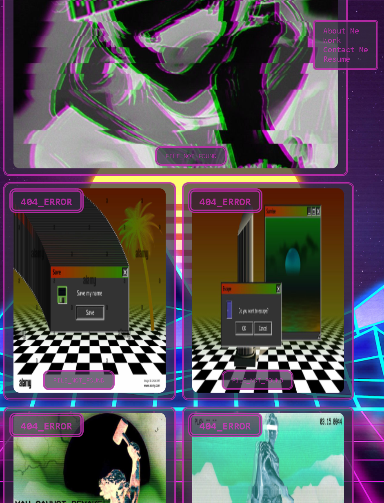

`Mobile`
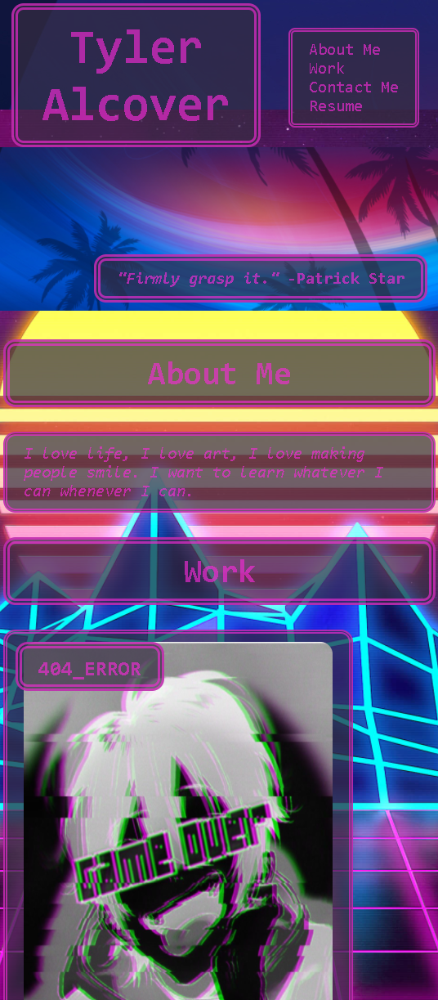

In addition, my page will alter its formatting when changing between device screen-size.

## Navigation Bar

`Desktop`
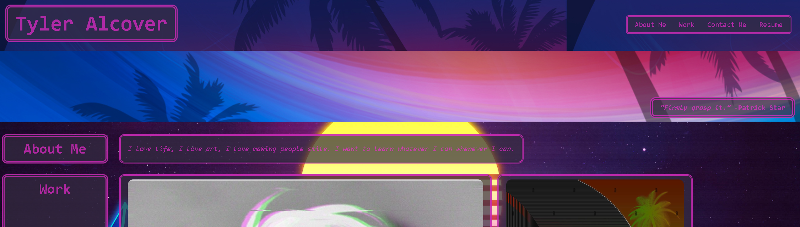

`Tablet`
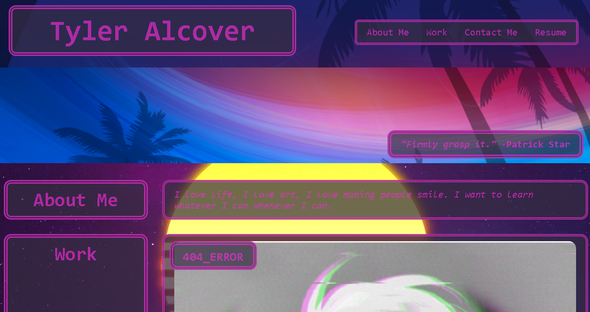

`Mobile`
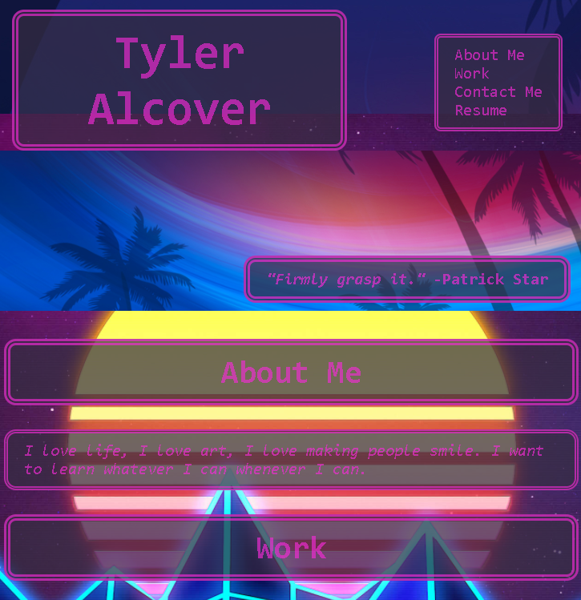

## About Me

`Desktop`
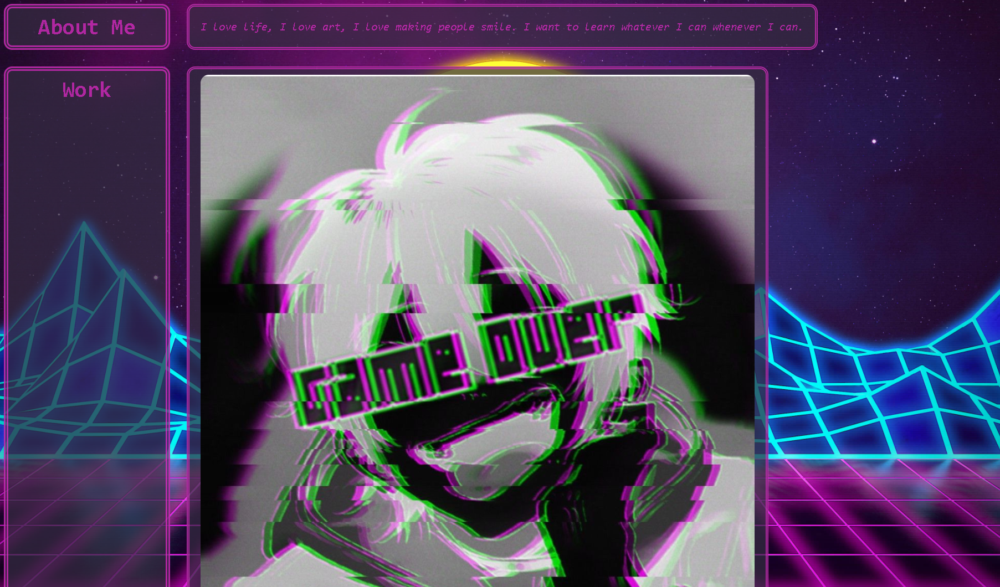

`Tablet & Mobile`
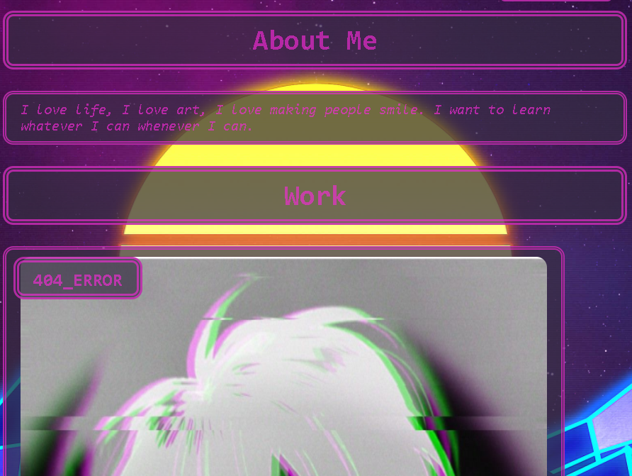

## Project Links

`Desktop`
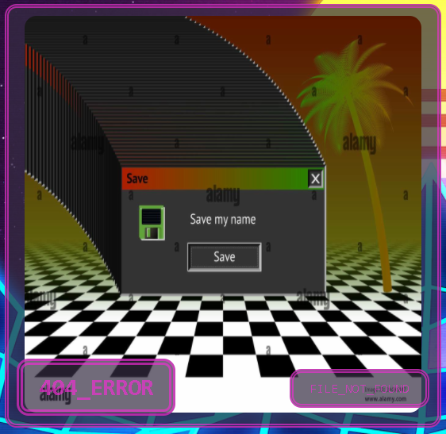

`Tablet`
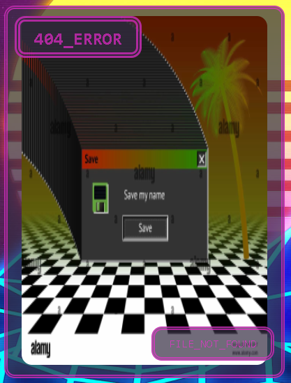

`Mobile`
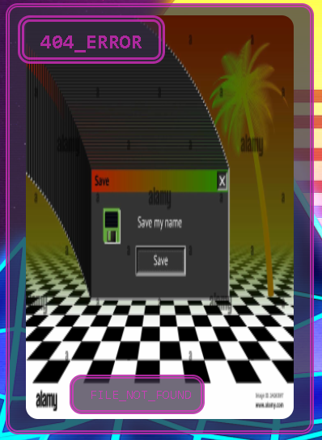

## Contact

`Desktop`

`Tablet & Mobile`
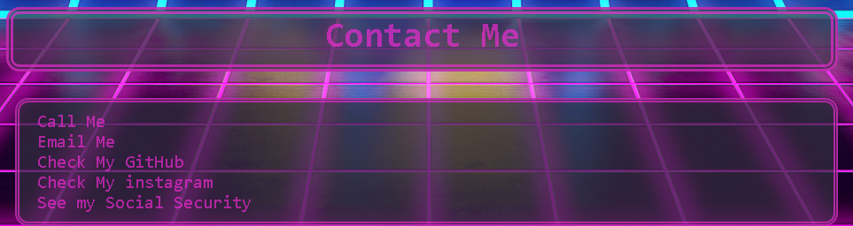

## My links

* `GitHub Repo`: https://github.com/KIMOISQUIGGLES/02--Portfolio
* `My Portfolio`: https://kimoisquiggles.github.io/02--Portfolio/